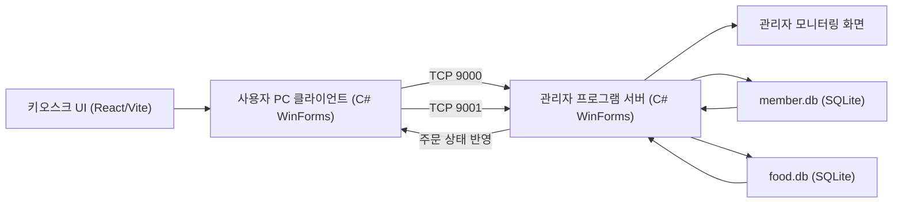

# PC방 키오스크 관리 시스템 (PC-bang Kiosk Management System)
> 관리자 프로그램 · 키오스크 UI · 사용자 PC 클라이언트를 TCP/IP로 연결한 3-tier PC방 통합 관리 플랫폼

## 📌 프로젝트 정보
| 항목 | 내용 |
|------|------|
| 개발 기간 | 2026.03.05 ~ 2026.03.17 |
| 팀 구성 | 5인 팀 프로젝트 |
| 담당 역할 | 부팀장 · 전체 설계 및 구현, 코드 병합 |
| 시연 영상 | 준비 중 |

## 🎯 프로젝트 개요
PC방 운영에 필요한 회원·주문·결제 흐름을 하나로 묶기 위해 개발한 통합 관리 플랫폼입니다.
관리자 프로그램(C# WinForms), 키오스크 UI(React/Vite), 사용자 PC 클라이언트(C# WinForms)를 분리한 3-tier 구조로 설계했으며, 각 구성 요소는 TCP/IP 소켓으로 실시간 통신합니다.
키오스크에서 발생한 주문을 서버를 거쳐 SQLite DB에 적재하고, 관리자 화면에서 즉시 모니터링할 수 있도록 데이터 흐름을 일원화했습니다.

## ✨ 주요 기능 / 담당 업무
- **TCP 프로토콜 설계**: Port 9000/9001을 용도별로 분리하고, 경량 정수 체크섬 래퍼를 구현하여 서버-클라이언트 간 안정적인 메시지 송수신을 확보했습니다.
- **DB 설계**: 회원 데이터(member.db)와 메뉴 데이터(food.db)를 SQLite 기반으로 분리 설계하고, 각 도메인에 대한 CRUD 로직을 구현했습니다.
- **키오스크 UI**: C# WinForms 기반으로 메뉴 탐색, 장바구니, 주문, 결제로 이어지는 사용자 결제 플로우를 구현했습니다.
- **관리자 프로그램**: C# WinForms Designer 기반으로 메뉴 버튼 연동 및 회원·주문 관리 기능을 구현하여 운영자가 한 화면에서 데이터를 제어하도록 했습니다.

## 🛠 기술 스택
### Software
- C# WinForms (.NET)
- React / Vite
- SQLite
- TCP/IP 소켓

## 🔀 시스템 아키텍처

키오스크에서 발생한 주문이 사용자 PC 클라이언트와 TCP 9000/9001 포트를 거쳐 관리자 서버로 전달되고, member.db·food.db에 적재된 뒤 관리자 모니터링 화면에 반영되는 흐름입니다.

## 📸 스크린샷
> `images/` 폴더에 이미지를 추가한 뒤 아래 경로를 맞춰주세요.

| 화면 | 설명 |
|------|------|
|  | 키오스크 메뉴 탐색 및 장바구니 화면 |
|  | 관리자 프로그램 회원·주문 관리 화면 |

## 🎬 시연 영상

