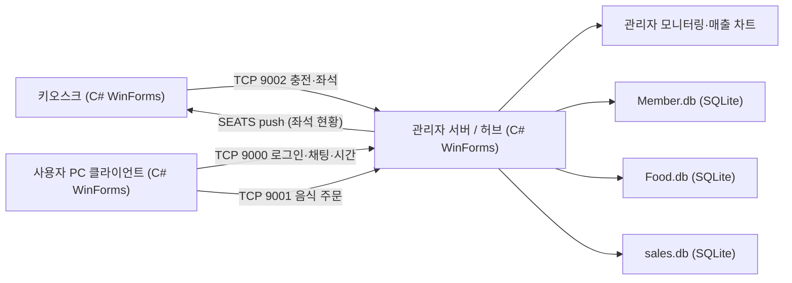
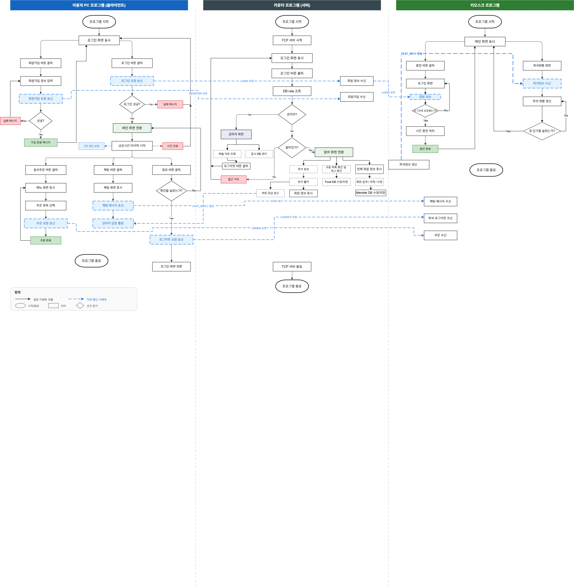

# PC방 키오스크 관리 시스템 (PC-bang Kiosk Management System)
> 관리자 프로그램 · 키오스크 UI · 사용자 PC 클라이언트를 TCP/IP로 연결한 3-tier PC방 통합 관리 플랫폼


## 📌 프로젝트 정보
| 항목 | 내용 |
|------|------|
| 개발 기간 | 2026.03.05 ~ 2026.03.17 |
| 팀 구성 | 5인 팀 프로젝트 |
| 담당 역할 | 부팀장 · TCP 프로토콜 설계 / SQLite DB 설계 / 키오스크 UI / 관리자 프로그램 |
| 시연 영상 | [YouTube 바로가기](https://youtu.be/MTrQJ0aKoDg) |

## 🎯 프로젝트 개요
PC방 운영에 필요한 회원·주문·결제 흐름을 하나로 묶기 위해 개발한 통합 관리 플랫폼입니다.
관리자 프로그램·키오스크·사용자 PC 클라이언트를 모두 C# WinForms로 구현하고 3-tier 구조로 분리 설계했으며, 각 구성 요소는 TCP/IP 소켓으로 실시간 통신합니다.
키오스크·사용자 PC에서 발생한 주문과 충전 요청을 관리자 서버(허브)를 거쳐 SQLite DB에 적재하고, 관리자 화면에서 즉시 모니터링·매출 집계할 수 있도록 데이터 흐름을 일원화했습니다.

## ✨ 주요 기능 / 담당 업무
- **TCP 프로토콜 설계**: 관리자 서버를 허브로 두고 용도별 3개 포트(9000 로그인·채팅·시간 / 9001 음식 주문 / 9002 키오스크 충전)를 분리 설계했습니다. 파이프(`|`) 구분자 기반 텍스트 프로토콜과 경량 정수 체크섬 래퍼를 직접 구현하여 서버-클라이언트 간 안정적인 메시지 송수신을 확보했습니다.
- **DB 설계**: 회원 데이터(`Member.db`)와 메뉴 데이터(`Food.db`), 매출 기록(`sales.db`)을 SQLite 기반으로 도메인별 분리 설계하고, 각 도메인에 대한 CRUD 로직과 주문 시 판매량·재고량 동시 갱신 로직을 구현했습니다.
- **키오스크 UI**: 메뉴 탐색, 장바구니, 주문, 결제로 이어지는 사용자 결제 플로우와 좌석 현황 표시를 구현했습니다.
- **관리자 프로그램**: C# WinForms 기반으로 회원·주문 관리와 `Food.db` 그리드뷰 편집/저장, `sales.db` 기반 월별·시간대별 매출 차트를 구현하여 운영자가 한 화면에서 데이터를 제어하도록 했습니다.

## 🛠 기술 스택
### Software
- C# WinForms (.NET) — 관리자·키오스크·사용자 클라이언트
- SQLite (System.Data.SQLite)
- TCP/IP 소켓 (TcpListener / TcpClient, async)

## 🔀 시스템 아키텍처

관리자 서버는 `TcpListener`로 3개 포트를 동시에 대기하는 허브 역할을 합니다. 사용자 PC는 9000(로그인·채팅·시간 요청)과 9001(음식 주문)로, 키오스크는 9002(로그인·충전)로 접속합니다. 주문이 들어오면 `Food.db`·`sales.db`가 갱신되고, 좌석 상태가 바뀌면 서버가 키오스크로 `SEATS` 메시지를 push하여 좌석 현황을 실시간 반영합니다.

## 💻 핵심 코드 (담당 역할)

### 1. 경량 정수 체크섬 래퍼 (`Checksum.cs`)
메시지 끝에 `#CHK:XXXX` 형식으로 4자리 16진수 해시를 첨부하고, 수신 시 본문과 해시를 분리해 무결성을 검증합니다. UTF-8 바이트 합산으로 한글 포함 다국어를 안전하게 처리하며, 검증 실패 시 `null`을 반환해 손상된 메시지를 무시 처리합니다.

```csharp
public static class Checksum
{
    private const string SEP = "#CHK:";

    // 메시지에 체크섬을 붙여 반환  → "ACK|1|OK#CHK:01B6"
    public static string Wrap(string body) => body + SEP + ComputeHash(body);

    // 체크섬 검증 후 원본 메시지 반환 (실패 시 null)
    public static string Unwrap(string line)
    {
        if (line == null) return null;
        int idx = line.LastIndexOf(SEP);
        if (idx < 0) return null;

        string body = line.Substring(0, idx);
        string hash = line.Substring(idx + SEP.Length);
        return hash == ComputeHash(body) ? body : null; // 불일치 시 null
    }

    private static string ComputeHash(string text)
    {
        byte[] bytes = Encoding.UTF8.GetBytes(text);
        int sum = 0;
        for (int i = 0; i < bytes.Length; i++)
            sum = (sum + bytes[i]) & 0xFFFF;   // 16비트 마스크로 오버플로 방지
        return sum.ToString("X4");             // 4자리 16진수
    }
}
```

### 2. 포트별 독립 재연결 루프 + 체크섬 수신 처리 (`TcpServer.cs`)
서버는 Singleton으로 동작하며 포트마다 독립적인 비동기 루프를 돌립니다. `CancellationToken`으로 정상 종료를 보장하고, 연결이 끊기면 1초 후 자동 재대기합니다. 모든 수신 메시지는 `Checksum.Unwrap`으로 먼저 검증하고, 응답은 `Checksum.Wrap`으로 감싸 송신합니다.

```csharp
private async Task Loop9000Async(CancellationToken token)
{
    _listener9000 = new TcpListener(IPAddress.Any, 9000);
    _listener9000.Start();
    while (!token.IsCancellationRequested)
    {
        try
        {
            _client9000 = await _listener9000.AcceptTcpClientAsync();
            var ns = _client9000.GetStream();
            _reader9000 = new StreamReader(ns, Encoding.UTF8);
            _writer9000 = new StreamWriter(ns, Encoding.UTF8) { AutoFlush = true };
            await Recv9000Async(token);          // 수신 루프
        }
        catch (OperationCanceledException) { break; }
        catch (Exception ex) { AddLog("[9000 오류] " + ex.Message); await Task.Delay(1000); }
        finally { /* writer/reader/client Dispose */ }
    }
}

private async Task Recv9000Async(CancellationToken token)
{
    while (!token.IsCancellationRequested)
    {
        string raw = await _reader9000.ReadLineAsync();
        if (raw == null) break;

        string line = Checksum.Unwrap(raw.Trim());          // ① 무결성 검증
        if (line == null) { AddLog("[9000] 체크섬 오류: " + raw); continue; }

        string resp = null;
        if (line.StartsWith("LOGIN|")) resp = DoLogin(line); // ② 프로토콜 분기
        else if (line.StartsWith("REGISTER|")) resp = DoRegister(line);
        // ... TIME_REQ / LOGOUT / CHAT / CHAT_POLL

        if (resp != null)
            await _writer9000.WriteLineAsync(Checksum.Wrap(resp)); // ③ 체크섬 첨부 송신
    }
}
```

### 3. 주문 수신 시 Food.db·sales.db 동시 갱신 (`TcpServer.cs`)
9001 포트로 들어온 주문 메시지(`ORDER|주문번호|item:qty,...|총액`)를 파싱해 상품별 판매량은 올리고 재고량은 내리며(`Math.Max(0, ...)`로 음수 방지), 매출 차트용 `sales.db`에도 판매 이력을 적재합니다.

```csharp
private void UpdateFoodOnOrder(string itemsStr)
{
    foreach (string pair in itemsStr.Split(','))
    {
        string[] kv = pair.Split(':');
        if (kv.Length != 2) continue;
        string productName = kv[0].Trim();
        if (!int.TryParse(kv[1].Trim(), out int qty)) continue;

        // Food: 판매량↑ 재고량↓ (재고 음수 방지) + 갱신 시각 기록
        using (var cmd = new SQLiteCommand(
            "UPDATE Food SET sale=@s, inventory=@i, date=@d, hour=@h WHERE id=@id", conn))
        {
            cmd.Parameters.AddWithValue("@s", curSale + qty);
            cmd.Parameters.AddWithValue("@i", Math.Max(0, curInv - qty));
            // ...
        }

        // sales.db: 차트 집계용 판매 이력 INSERT
        using (var sCmd = new SQLiteCommand(
            "INSERT INTO sales_data(Product_name, sale, price, date, hour) VALUES(@n,@s,@p,@d,@h)", sConn))
        { /* ... */ }
    }
}
```

## 🔧 기술적 도전과 해결 (Technical Challenges)

### Q1. 한글이 섞인 TCP 메시지의 무결성을 어떻게 가볍게 검증했나?
> **Challenge:** 메뉴명·채팅 등 한글이 포함된 메시지가 네트워크 전송 중 변조·손상되는 경우를 감지해야 했습니다. 무거운 해시 라이브러리를 도입하면 키오스크/클라이언트 환경에 부담이 컸습니다.
> **Solution:** 외부 의존성 없이 동작하는 경량 정수 체크섬을 직접 구현했습니다. 문자열을 UTF-8 바이트로 변환해 합산하므로 한글 등 다국어를 안전하게 처리하고, `& 0xFFFF` 16비트 마스크로 누적 합의 오버플로를 막아 항상 4자리 16진수로 떨어지게 했습니다. 송신은 `Wrap()`, 수신은 `Unwrap()`으로 일원화하고, 검증 실패 시 `null`을 반환해 손상 메시지를 자연스럽게 무시하도록 설계했습니다.

### Q2. 3개 포트를 쓰는 서버에서 한 연결이 끊겨도 전체가 멈추지 않게 하려면?
> **Challenge:** 로그인(9000)·주문(9001)·키오스크(9002)가 한 서버에 모이는 구조라, 특정 클라이언트의 연결 종료나 예외가 서버 전체를 중단시키면 안 됐습니다. 종료 시점에 소켓을 깔끔히 정리하는 것도 필요했습니다.
> **Solution:** 서버를 Singleton으로 두고 포트별로 독립적인 비동기 재연결 루프(`Loop9000/9001/9002Async`)를 분리했습니다. 각 루프는 자체 `try/catch/finally`로 예외를 흡수하고 1초 후 재대기하므로 한 포트의 장애가 다른 포트에 전파되지 않습니다. `CancellationToken`으로 모든 루프를 일괄 종료하고, `StreamWriter`는 `AutoFlush=true`로 두어 응답 누락을 방지했습니다.

### Q3. 로그아웃 시 남은시간 저장에서 발생한 데이터 손실 버그는?
> **Challenge:** `LOGOUT|id|remainSeconds` 처리 시 `int.TryParse`의 `out` 파라미터는 파싱 실패하면 값을 `0`으로 덮어씁니다. 그대로 DB에 반영하면 시간 데이터가 없는 요청까지 남은시간을 0으로 초기화해 회원 시간이 사라질 위험이 있었습니다.
> **Solution:** 파싱 성공 여부를 별도 `bool hasTime` 플래그로 분리해, 시간 값이 실제로 전달된 경우에만 `time` 컬럼을 갱신하고, 없으면 좌석번호만 초기화하도록 분기 처리했습니다. 두 경로 모두 로그를 남겨 운영 중 추적이 가능하도록 했습니다.

## 📸 스크린샷
> `images/` 폴더에 이미지를 추가한 뒤 아래 경로를 맞춰주세요.

| 화면 | 설명 |
|------|------|
|  | 키오스크 메뉴 탐색 및 장바구니·결제 화면 |
|  | 관리자 프로그램 회원·주문 관리 화면 |
|  | 관리자 매출 차트 (월별·시간대별, sales.db 집계) 및 Food.db 그리드뷰 |

## 🎬 시연 영상
[](https://youtu.be/MTrQJ0aKoDg)
